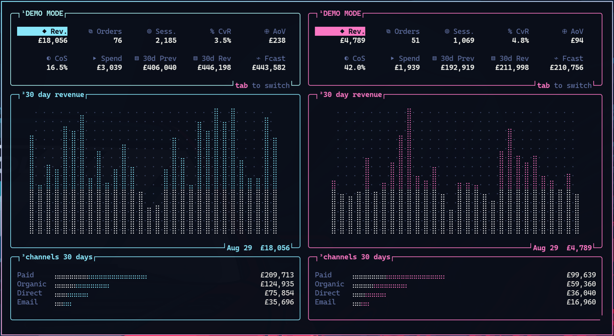
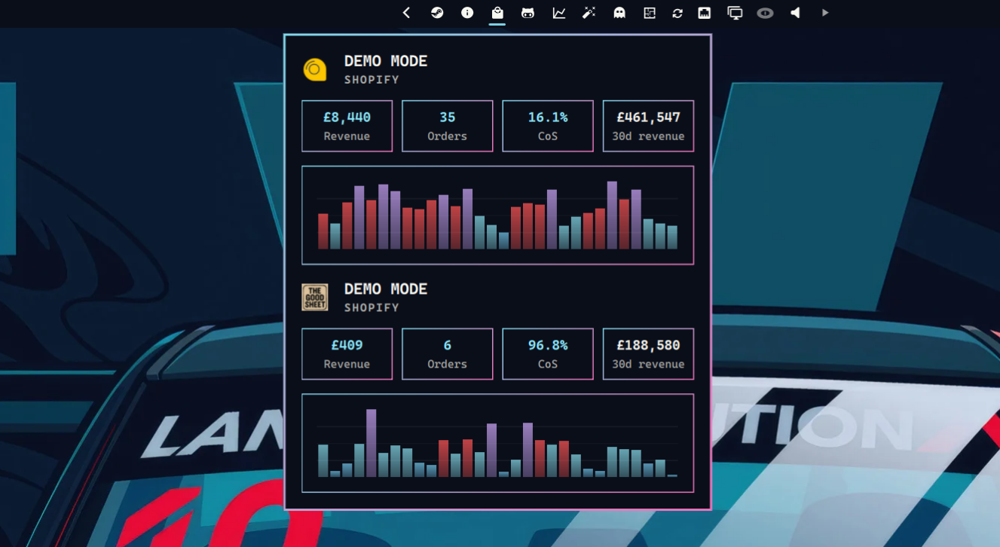

# Omarchy Shopify Plugin





Bar widget for Shopify store revenue: today's KPIs and a sparkline for every store in the data source.

## Install

```bash
omarchy plugin add https://github.com/sebday/omarchy-plugin-shopify.git
omarchy plugin enable evo.shopify
```

Plugins run as unsandboxed code inside `omarchy-shell`. Review the files before enabling.

## Requirements

- `sqlite3` and `jq` on `PATH`
- `ssh` on `PATH` when `dataPath` is remote
- ecommerce-data KPI sqlite dumps (one `*.sqlite` per store)

```json
"shopify": {
  "dataPath": "zotac:~/projects/data-store",
  "timezone": "Europe/London"
}
```

`dataPath` points at the sqlite directory on the remote host. The plugin queries it over SSH — no local copy.

| `dataPath` | Behaviour |
|---|---|
| `zotac:~/projects/data-store` | SSH to `zotac` (default when unset) |
| `user@host:~/path` | SSH with explicit user |
| `/local/path` | Local read-only sqlite queries |

Stores are auto-discovered from `*.sqlite` files in `dataPath`. To set titles and admin links explicitly:

```json
"stores": [
  { "key": "DIY", "title": "DIY", "adminSlug": "your-store", "sqliteKey": "diy" }
]
```

## Bar

| Click | Action |
|---|---|
| Left | Toggle status popup |

Left-click opens a compact popup with today's KPIs and a 30-day revenue chart for each store. Each card uses the store favicon when `{sqliteKey}.favicon.png` is available locally (or next to the sqlite files). The bar reads a local cache on startup (no SSH) and refreshes it in the background every 5 minutes after the popup is first opened.

| State | Appearance |
|---|---|
| Revenue today | Accent |
| Store or config error | Urgent |
| No stores | Dimmed |


## Dashboard

```bash
go build -o ~/.local/bin/evoshopify ./cmd/evoshopify
evoshopify
```

Override the plugin root with `EVOSHOPIFY_ROOT` if `shopify-status` is not next to the binary or in `~/.config/omarchy/plugins/evo.shopify`.

| Key | Action |
|---|---|
| `q` / `esc` | Quit |
| `r` | Refresh |
| `d` | Toggle demo data from `demo.json` |
| Tab | Previous / next stat |

Demo data lives in `demo.json` at the plugin root. `shopify-status demo` prints the same snapshot for the bar popup and TUI.

## IPC

```bash
omarchy-shell shell toggle evo.shopify '{}'
omarchy-shell evo.shopify refresh
```

| Call | Action |
|---|---|
| `open` / `show` | Open the popup |
| `close` / `hide` | Close the popup |
| `toggle` | Toggle the popup |
| `refresh` | Refresh status |
